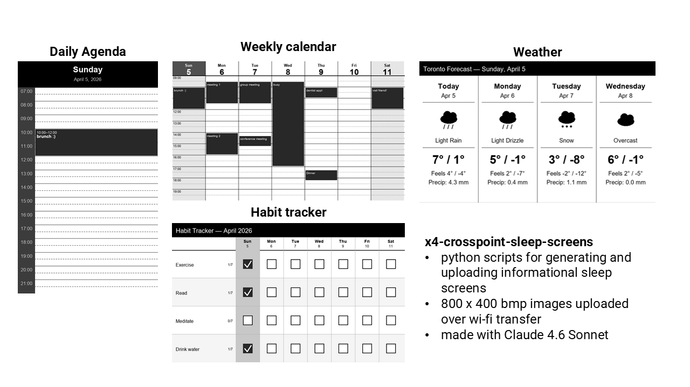

# E-Ink Display Scripts for CrossPoint / Xteink X4

A collection of Python scripts that generate greyscale BMP images for the **Xteink X4** e-ink display running the **[CrossPoint firmware](https://github.com/crosspoint-reader/crosspoint-reader)**, and automatically upload them to the device over Wi-Fi. (Code written by Claude 4.6 Sonnet)


---

## Screens

| Script | Description |
|---|---|
| `calendar_eink.py` | Weekly calendar pulled from Google Calendar |
| `weather_eink.py` | 4-day weather forecast (Open-Meteo, no API key needed) |
| `agenda_eink.py` | Today's events from Google Calendar |
| `habit_eink.py` | Weekly habit tracker grid |

---

## Requirements

- Python 3.9 or higher
- A CrossPoint-flashed Xteink X4 (or any device serving files at a known IP)
- A Google account (for the calendar and agenda scripts)

Install dependencies:

```bash
pip install Pillow requests tzdata google-auth-oauthlib google-auth-httplib2 google-api-python-client
```

---

## Setup

### 1. Clone the repo

```bash
git clone https://github.com/patonum/x4-crosspoint-sleep-screens
cd x4-crosspoint-sleep-screens
```

### 2. Configure your network

Open `config.py` and update `NETWORK_PROFILES` with your device's IP address.
The IP depends on how your laptop and X4 are connected:

- **Home Wi-Fi** — connect both to your home wi-fi, on the x4 using the wi-fi file transfer. If you have different wi-fi's you use (e.g. home, phone hotspot, work) your device might have different IPs for wi-fi network. This is why you have selection option before it tries to connect.
- **X4 hotspot** — connect your laptop to the X4's hotspot (no wi-fi capabilities)


```python
NETWORK_PROFILES = {
    "1": ("Home",    "http://11.111.11.11"),  # replace with your X4's IP
    "2": ("Hotspot", "http://11.111.11.11"),  # you can delete this or add more IPs
}
```

Also update `EINK_FOLDER` to match the folder on your X4's SD card where you want files saved:

```python
EINK_FOLDER = "/sleep"
```

### 3. Set up Google Calendar (calendar and agenda scripts only)

1. Go to [console.cloud.google.com](https://console.cloud.google.com) and create a new project
2. Go to **APIs & Services → Library**, search for **Google Calendar API** and enable it
3. Go to **APIs & Services → Credentials → Create Credentials → OAuth client ID**
4. Choose **Desktop app**, download the JSON file and rename it to `credentials.json`
5. Place `credentials.json` in the same folder as the scripts
6. On first run a browser window will open asking you to log in — after that a `token.json` is saved automatically and no login is needed again

> **Note:** Google may show an "unverified app" warning. Click **Advanced → Go to [app name] (unsafe)** to proceed — this is normal for personal scripts.

### 4. Configure weather location

Open `weather_eink.py` and set your coordinates and timezone:

```python
LATITUDE  = 11.1111        # your latitude
LONGITUDE = -11.1111         # your longitude
TIMEZONE  = "Timezone"  # your timezone
```

Find your coordinates at [latlong.net](https://www.latlong.net).
Find your timezone string [on Wikipedia under TZ identifier](https://en.wikipedia.org/wiki/List_of_tz_database_time_zones).

### 5. Set up habits

Edit `habits.json` to list the habits you want to track:

```json
{
    "habits": ["Exercise", "Read", "Meditate", "Drink water"],
    "completed": {}
}
```

Run `checkin.py` each evening to mark off what you completed:

```bash
python checkin.py
```

---

## Usage

### Run everything at once

```bash
python run_all.py
```

This asks which scripts to run and which network to use, then runs them one after the other — uploading each BMP to the device automatically.

### Run a single script

Each script can also be run on its own:

```bash
python calendar_eink.py
python weather_eink.py
python agenda_eink.py
python habit_eink.py
```

### Browse files on the device

```bash
python seefolder.py
```

### Delete files on the device

```bash
python deletefile.py
```

Supports navigating into subfolders before selecting files to delete.

---

## Auto-updating on Windows

To have the scripts run automatically every morning, use **Task Scheduler**:

1. Open Task Scheduler → **Create Basic Task**
2. Set the trigger to **Daily** at your preferred time
3. Set the action to **Start a program**
4. Program: `python`
5. Arguments: `run_all.py`
6. Start in: the folder where your scripts live

---

## File structure

```
eink-display-scripts/
├── config.py            # shared network and device settings
├── run_all.py           # launcher — runs multiple scripts at once
├── calendar_eink.py     # weekly calendar
├── weather_eink.py      # 4-day weather forecast
├── agenda_eink.py       # daily agenda
├── habit_eink.py        # habit tracker
├── checkin.py           # daily habit check-in
├── seefolder.py         # browse device files
├── deletefile.py        # delete device files
├── habits.json          # your habit data (gitignored)
├── credentials.json     # Google OAuth credentials (gitignored)
├── token.json           # Google auth token (gitignored)
└── output/              # generated BMP files (gitignored)
```

---

## Adding your own screens

Each display script follows the same pattern:

1. Fetch data (API, local file, or pure calculation)
2. Draw on an 800×480 greyscale Pillow canvas
3. Save as BMP and upload via `upload_to_eink(filepath, eink_host)`

To add a new script to `run_all.py`, add one line to the `SCRIPTS` dict at the top:

```python
SCRIPTS = {
    ...
    "5": ("My New Screen", "my_script", "generate_my_screen"),
}
```

---

## Credits
- Claude 4.6 Sonnet [Anthropic]
- [CrossPoint firmware](https://github.com/crosspoint-reader/crosspoint-reader) by [@daveallie](https://github.com/daveallie) and contributors
- Weather data from [Open-Meteo](https://open-meteo.com) (free, no API key required)
- Calendar data from the [Google Calendar API](https://developers.google.com/calendar)
